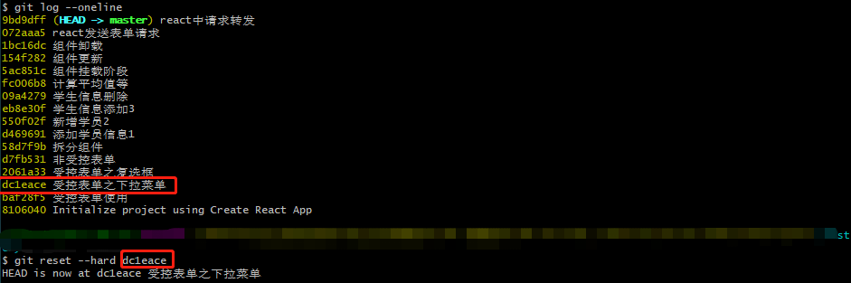

1. ==先找到 reactproject 文件目录，复制出来一个备份==

2. 打开reactproject文件目录，再次目录打开git bash

3. 在git bash 中输入指令 `git log --oneline`

4. 输入指令 `git  reset  --hard  <commit id>`

4. 现在我们就完成了找到需求的源码了

5. 后续如果需要寻找其他代码时，请操作第一步复制出来的备份（==操作前请再次复制一个备份==）